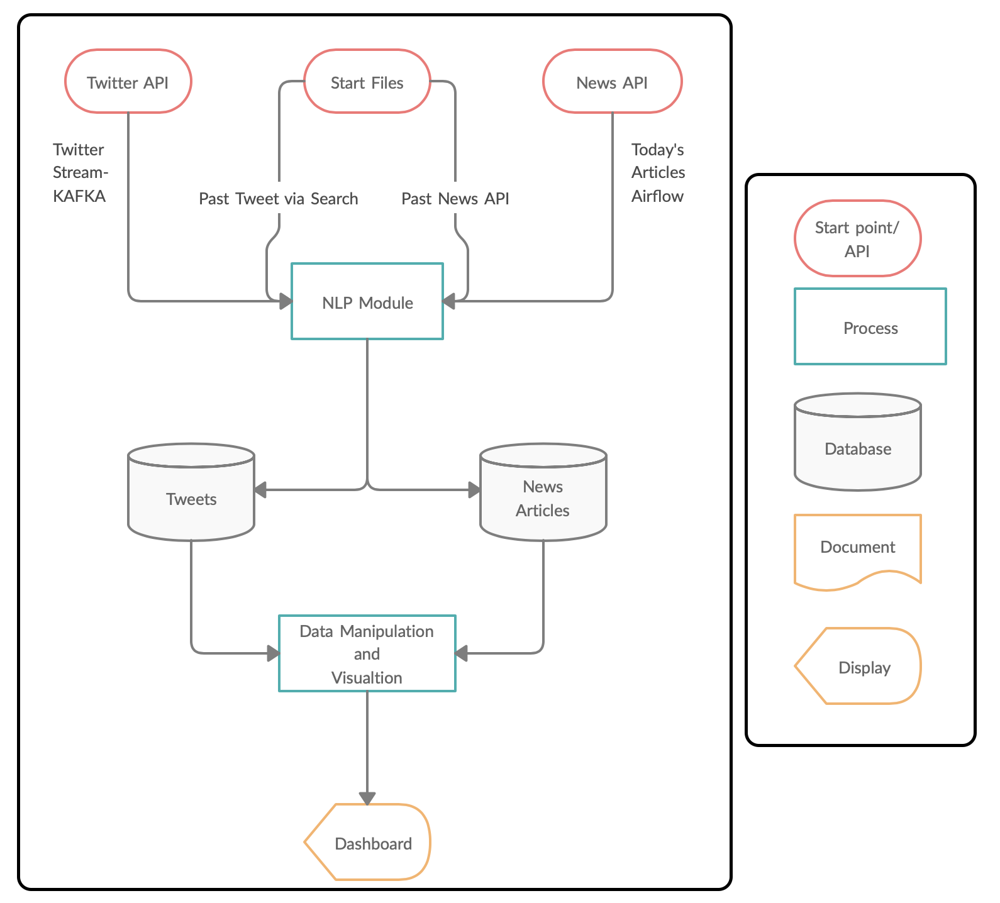

 

# NLP Covid-19 Sentiment Pipeline

For our final project at Zip Code Wilmington, we chose to view sentiment analysis on COVID-19 for two different sources; Articles from a News API and Tweets from Twitter's API. For the news api we will be using Airflow to gather new articles every hour regarding COVID-19. For the Twitter API we have used Kafka to produce a stream of all tweets regarding COVID-19. 

After acquiring this data we run it through a Vader model to analyze sentiment of both the media and tweets. Then store it in a SQL database. Using airflow we will continuously clean the data and show our results using various visualization tools. Check out our pipeline below.  

---
### Pipeline Flow

 

---
## Meet the team
  
  
### Apoorva Shukla  
[GitHub](https://github.com/ApoorvaShukla88)  
[Connect on LinkedIn](https://www.linkedin.com/in/apoorva-shukla-mishra/) 
 
  - "Data Engineer in training with a passion for problem solving and learning new skills. Highly organized in handling multiple task in competitive environment."  
 
    
    
  
  
### James Kocher  
[GitHub](https://github.com/JKocher13)  
[Connect on LinkedIn](https://www.linkedin.com/in/james-kocher/)

  - "Being the “Excel guy” in the office, I decided to take my skills to the next level and become the “data guy” when I enrolled in Zip Code Wilmington’s first ever Data Engineering cohort. Since then, I have been sharpening my skills in Python and MySQL and applying my creative and analytical mindset as I aspire to become a successful data engineer."  

    
    
### James Thompson  
[GitHub](https://jlat07.github.io/JLAT_Portfolio/)  
[Connect on LinkedIn](https://www.linkedin.com/in/james-la-thompson/)

  - "Studied pyshics and math at Lincoln University. Previously worked in the Architectural Engineering and Construction (AEC) Industry as a Building Information Modeling Designer, doing value engineering by using Autodesk programs to create 3D models. Strong problem-solving skills and passionate about automating solutions using code."  
    

---  
### APIs Used  

- [Twitter's Streaming API](https://developer.twitter.com/en/docs/tutorials/consuming-streaming-data)
  
- [News API](https://newsapi.org)
 
### Frameworks Used  

- Kafka
- Spark
- Airflow
- PANDAS 
- Plotly Dash   
  
### Where to start  
  
To run this program we ask you execute the follow steps.

-Set up a dotenv file with the approriate keys for News API and Twitter API

-Change your directory to StartFile and run the follow commands on your command line:

- "mysql -u username -p < TwitterSetup.sql"
- "mysql -u username -p < NewsSetup.sql"
- "python start.py"

-From the airflow_dag directory add the file "final_project_dag.py" to your airflow home in the dags folder as well as set up your dotenv file in the same folder. Start airflow webserver and scheduler and turn on the final_project_dag.

-Change directory to the twitter_kafka folder and start running your kafka zookeeper and server. After that run both conusmer.py and producer.py simultaneously

-Open the visualation software and watch as results poor in on national sentiment towards COVID-19.  

---
### [Link to original project requirements](https://github.com/Zipcoder/DataZCW-Final-Project)
